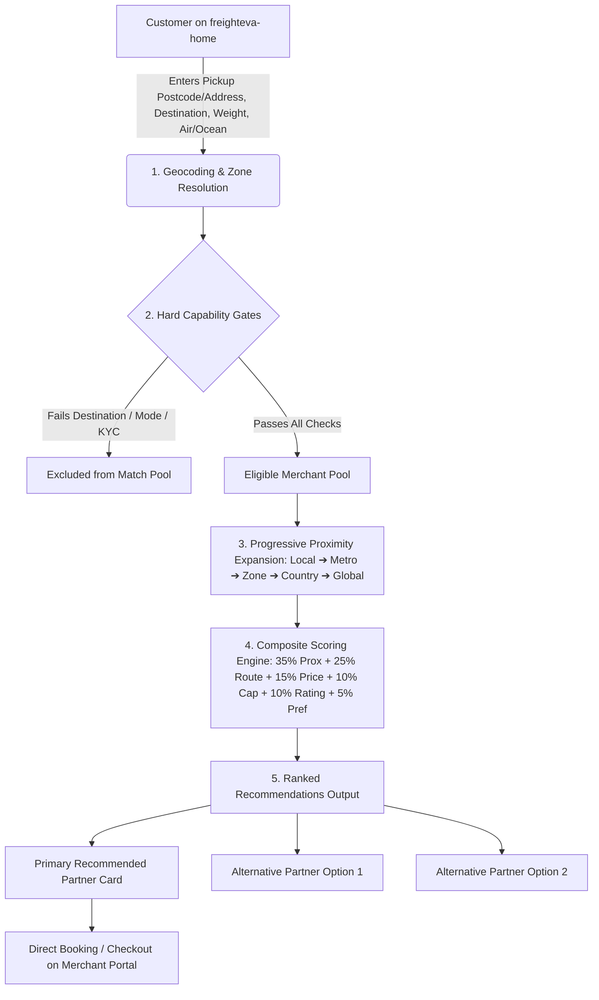

# 🚀 Freighteva Global Routing Engine — Implementation Plan

**Document Version:** 2.0.0  
**Requirement Source:** `docs/07-09-26-ROUTING REQUIREMENT 08.docx`  
**Target Systems:** `freighteva-be` (Laravel Multi-Tenant Backend) & `freighteva-home` (Marketplace Frontend)  
**Date:** September 7, 2026  

---

## 📌 1. Executive Summary & Objective

The objective is to implement the **Freighteva Global Location-Aware Routing Engine**, transforming Freighteva from a static directory into an **autonomous, capability-first, proximity-aware freight marketplace**.

### 🎯 Core Philosophy:
> **"Route every customer to the nearest qualified freight partner capable of serving their destination and shipment requirements."**

* **Crucial Rule:** **Route Capability Strictly Overrides Proximity.**  
  *(If Merchant A is 5 km away but does NOT ship to Nigeria, and Merchant B is 35 km away and specializes in Nigeria — Freighteva routes to Merchant B).*

---

## 🏗️ 2. Architectural Flow & Logic



---

## 🗺️ 3. The 4-Zone Geographic Model

Freighteva categorizes origin countries into **4 operational geographic zones** (e.g., USA, UK, Canada, Australia, Germany, France, Netherlands).

* **Internal Routing Mechanism:** Customers do not see internal zone labels (e.g. *"You are in Zone 3"*). Instead, they see: **"Verified freight partners near you"**.
* Every merchant is assigned:  
  $$\text{Country} \longrightarrow \text{Zone} \longrightarrow \text{Metro / City} \longrightarrow \text{Service Radius (km)}$$

---

## 🛡️ 4. Hard Capability Filtering (Eligibility Gates)

Before running distance or score calculations, non-qualifying merchants are eliminated:

| Gate | Validation Rule | Behavior if Failed |
| :--- | :--- | :--- |
| **Rule A — Destination Capability** | Does merchant serve the destination country and city? | **Excluded (Score = 0)** |
| **Rule B — Freight Mode** | Does merchant handle the requested mode (`Air` vs `Ocean`)? | **Excluded** |
| **Rule C — Shipment Capability** | Is weight & dimension within merchant min/max capacity? | **Excluded** |
| **Rule D — Compliance & Verification** | Is merchant KYC/KYB verified, active, and accepting bookings? | **Excluded** |
| **Rule E — Service Radius** | Does merchant provide pickup for customer location, or is drop-off available? | **Excluded from pickup** |

---

## 🔍 5. Progressive Proximity Hierarchy

Search expands outward in concentric geographic tiers:

```
Customer Postcode
       ↓
Tier 1 — Local (0 – 15 km / 0 – 10 miles)
       ↓ (if insufficient options)
Tier 2 — Extended Local (15 – 40 km / 10 – 25 miles)
       ↓
Tier 3 — Same Metro / City
       ↓
Tier 4 — Same Freighteva Zone
       ↓
Tier 5 — National (Same Country)
       ↓
Tier 6 — Cross-Border / Global Network Fallback
```

---

## 📊 6. Composite Routing Scoring Formula (0 – 100 Scale)

For all eligible merchants that pass the hard capability gates, the engine calculates a multi-factor score:

$$\text{Routing Score} = (0.35 \times \text{Proximity}) + (0.25 \times \text{Route Fit}) + (0.15 \times \text{Price}) + (0.10 \times \text{Capacity}) + (0.10 \times \text{Performance}) + (0.05 \times \text{Preference})$$

### Factor Breakdown:
1. **Proximity (35%):** Haversine distance from customer pickup coordinates to merchant location (closer = higher score).
2. **Route Fit & Specialization (25%):** Merchant's corridor expertise, direct flights/vessel routes to the destination.
3. **Price & Value (15%):** Cost competitiveness compared to route average.
4. **Capacity & Operational Availability (10%):** Available booking bandwidth and current load.
5. **Merchant Performance (10%):** Rating, on-time handover rate, low cancellation rate, and fast response times.
6. **Customer Preference (5%):** Exact match with requested service type (e.g. Doorstep Pickup vs Drop-off).

---

## 📦 7. Output Contract (API Payload)

The routing engine returns a ranked payload:
1. **Primary Recommended Partner** (Tagged: `Best Match & Nearest`)
2. **Alternative Partner 1** (e.g. Lowest Price or Fastest Transit)
3. **Alternative Partner 2** (Alternative Carrier Option)

---

## 🛠️ 8. Backend Implementation Steps (`freighteva-be`)

### Phase 1: Database & Migrations
1. **`tenants` / `merchants` Table Extensions:**
   * `latitude` (decimal 10,7)
   * `longitude` (decimal 10,7)
   * `country_id` (foreign key)
   * `zone_code` (e.g. `US-ZONE-1`, `UK-ZONE-2`)
   * `metro_area` (string)
   * `service_radius_km` (integer, default 25)
   * `is_verified` (boolean, KYC/KYB approval)
   * `rating_score` (decimal 3,2)
   * `booking_success_rate` (decimal 5,2)

2. **`merchant_shipping_capabilities` Table:**
   * `id`
   * `tenant_id` (foreign key)
   * `origin_country_id`
   * `destination_country_id`
   * `freight_mode` (`air`, `ocean`, `both`)
   * `min_weight_kg`, `max_weight_kg`
   * `pickup_available` (boolean)
   * `dropoff_available` (boolean)
   * `base_rate_per_kg`
   * `min_transit_days`, `max_transit_days`
   * `is_active` (boolean)

---

### Phase 2: Core Routing Engine Service (`app/Services/Routing/`)
1. **`GeocodingService.php`:**
   * Takes customer address / postal code and country.
   * Resolves exact coordinates (`latitude`, `longitude`) and maps to the corresponding Freighteva Zone.

2. **`FreightevaRoutingEngine.php`:**
   * **Step 1:** Queries `merchant_shipping_capabilities` for destination country + freight mode (`air`/`ocean`) + weight limits.
   * **Step 2:** Filters by merchant verification (`is_verified = true`, `status = active`).
   * **Step 3:** Computes Haversine distance ($\text{km}$) between customer coordinates and each merchant.
   * **Step 4:** Applies Progressive Proximity Tiers (Local $\to$ Metro $\to$ Zone $\to$ Country).
   * **Step 5:** Computes Composite Routing Score for each candidate.
   * **Step 6:** Sorts and returns **Primary Recommended Merchant + 2 Alternatives**.

---

### Phase 3: REST API Endpoints (`routes/api.php`)

#### `POST /api/v1/routing/match-merchants`
* **Request Body:**
  ```json
  {
    "pickup_country": "US",
    "pickup_postcode": "60601",
    "pickup_address": "Chicago, IL",
    "destination_country": "NG",
    "destination_city": "Lagos",
    "freight_mode": "air",
    "weight_kg": 10.5,
    "service_type": "pickup"
  }
  ```

* **Response Body:**
  ```json
  {
    "status": "success",
    "data": {
      "customer_location": {
        "zone": "US-MIDWEST-ZONE-2",
        "metro": "Chicago",
        "coordinates": { "lat": 41.881832, "lng": -87.623177 }
      },
      "primary_merchant": {
        "id": 2,
        "name": "Enitan Shipping Inc",
        "subdomain": "oneil",
        "custom_domain": "eohtllc.com",
        "distance_km": 5.2,
        "search_tier": "LOCAL",
        "routing_score": 92.5,
        "rating": 4.9,
        "estimated_price": 100.00,
        "currency": "USD",
        "transit_time": "3-5 Business Days",
        "booking_url": "https://eohtllc.com/shipment/create"
      },
      "alternative_merchants": [
        {
          "id": 5,
          "name": "Air Cargo Express",
          "distance_km": 12.4,
          "search_tier": "EXTENDED_LOCAL",
          "routing_score": 85.0,
          "estimated_price": 95.00,
          "currency": "USD"
        }
      ]
    }
  }
  ```

---

## 🛡️ 9. Client Coding Standards Compliance
1. **No Error Suppression:** Strict try-catch with error logging; no `@` operators.
2. **No `env()` in Application Code:** All configuration loaded via `config('services.routing...')`.
3. **No Default Dummy Fallbacks for Compulsory Data:** Missing `tenant_id`, coordinates, or origin/destination triggers explicit validation exceptions.
4. **Clean Presentation:** All distance and ranking math encapsulated strictly within backend services.

---

*Plan document created and ready for implementation.*
