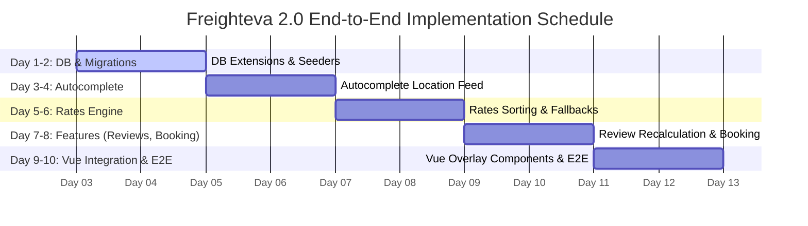

# Freighteva 2.0 Backend API & Vue Integration Plan

This document outlines the final implementation plan for the Laravel backend APIs and Vue 3 frontend integration for Freighteva 2.0, reflecting the dynamic bypass of authentication, dynamic booking flow, and reviews.

---

## 1. Overview
*   **App Name**: Freighteva 2.0
*   **Modules Covered**: Location Autocomplete, Search Rates Engine, Reviews & Ratings, Shipment Booking & Checkout
*   **Database**: `stack_freightmata_vue` (reusing existing tables, adding rating & subscription columns)

### System Tenancy
*   **Tenants**: Merchants are registered in the `tenants` table with custom cached average ratings (`rating_avg`) and rating counts (`rating_count`) to track carrier reputation.
*   **Authentication Bypass**: Following design requirements, all developed APIs are public endpoints to maintain direct integration with Respectmart.

---

## 2. Base URL
*   `http://localhost:8000/api`

---

## 3. Account & Resource Statuses

### Tenant Statuses
*   `active`: Verified merchant whose rates are searchable.
*   `pending`: Awaiting admin verification.
*   `suspended`: Restricted from receiving matches.

### Shipment Statuses
*   `booked`: Created via checkout page, ready for review.
*   `delivered`: Package delivered; review submission unlocked.

---

## 4. API Specifications

### 4.1 Location Autocomplete
Queries countries matching search queries.
*   **Endpoint**: `GET /search/autocomplete`
*   **Query Params**: `q=Tor`
*   **Success Response (200 OK)**:
    ```json
    {
      "success": true,
      "data": [
        { "city": "Toronto", "country": "Canada", "iso_code": "CA" }
      ]
    }
    ```

### 4.2 Search Rates Engine
Resolves origin/destination and calculates best matched shipment routes using ranking logic.
*   **Endpoint**: `POST /search/rates`
*   **Request Body**:
    ```json
    {
      "from": "Toronto, ON",
      "to": "Lagos, NG",
      "mode": "Air Freight",
      "weight": 5,
      "unit": "kg"
    }
    ```
*   **Ranking Logic**:
    1.  Subscription level (`tenants.sub_type`: Advanced > Intermediate > Starter)
    2.  Verification (`tenants.status` = active)
    3.  Rating score (`tenants.rating_avg` descending)
    4.  Price (`shipment_routes.shipping_rate` ascending)
*   **Success Response (200 OK)**:
    ```json
    {
      "success": true,
      "data": [
        {
          "tenant_id": 1,
          "initial": "D",
          "name": "Dipson Logistics LLC",
          "verified": true,
          "rating": "4.9",
          "reviews": 87,
          "location": "Toronto hub",
          "pickup": "Door-to-door",
          "tags": ["CA - NG specialty", "Air consolidation", "Insured"],
          "days": "7-9 days",
          "price": "$6.00",
          "total": "~ $30.00 USD",
          "featured": true
        }
      ]
    }
    ```

### 4.3 Submit Shipment Review
Submits a review for a shipment, recalculating and caching average ratings on the tenant.
*   **Endpoint**: `POST /shipments/{shipment}/reviews`
*   **Request Body**:
    ```json
    {
      "rating": 5,
      "comment": "Excellent care and fast delivery."
    }
    ```
*   **Success Response (201 Created)**:
    ```json
    {
      "success": true,
      "message": "Review submitted successfully.",
      "data": {
        "id": 42,
        "tenant_id": 1,
        "shipment_id": 10,
        "rating": 5,
        "comment": "Excellent care and fast delivery.",
        "reviewer_name": "John Doe",
        "created_at": "2026-07-02T12:00:00Z"
      }
    }
    ```

### 4.4 Retrieve Tenant Reviews
Fetches paginated reviews for a given tenant.
*   **Endpoint**: `GET /tenants/{tenant}/reviews`
*   **Success Response (200 OK)**:
    ```json
    {
      "success": true,
      "data": {
        "data": [
          {
            "id": 42,
            "tenant_id": 1,
            "shipment_id": 10,
            "rating": 5,
            "comment": "Excellent care and fast delivery.",
            "reviewer_name": "John Doe",
            "created_at": "2026-07-02T12:00:00Z"
          }
        ]
      }
    }
    ```

### 4.5 List Shipments
Lists all shipments inside the database.
*   **Endpoint**: `GET /shipments`
*   **Success Response (200 OK)**:
    ```json
    {
      "success": true,
      "data": [
        {
          "id": 10,
          "origin": "Toronto, ON",
          "destination": "Lagos, NG",
          "weight": 5,
          "status": "booked"
        }
      ]
    }
    ```

### 4.6 Book Shipment (Checkout)
Books a new shipment and registers it in the database.
*   **Endpoint**: `POST /shipments`
*   **Request Body**:
    ```json
    {
      "tenant_id": 1,
      "origin": "Toronto, ON",
      "destination": "Lagos, NG",
      "weight": 5,
      "mode": "Air Freight",
      "carrier": "Dipson Logistics LLC",
      "price": 6.00
    }
    ```
*   **Success Response (201 Created)**:
    ```json
    {
      "success": true,
      "message": "Shipment booked successfully!",
      "data": {
        "id": 11,
        "tenant_id": 1,
        "origin": "Toronto, ON",
        "destination": "Lagos, NG",
        "weight": 5,
        "mode": "Air Freight",
        "carrier": "Dipson Logistics LLC",
        "status": "booked",
        "invoice_no": "832912",
        "awb_number": "AWB938210",
        "total_amount": 30.00
      }
    }
    ```

---

## 5. Vue Frontend Integration

The Vue 3 frontend (`resources/frontend/src/`) integrates autocomplete suggestions, rate grids, booking checkout modals, and reviews feed queries.

### Search Interactivity
*   `HomePage.vue`: Listens to user inputs in "From" and "To" fields, queries `/api/search/autocomplete?q=...`, and displays interactive suggestions drop-down card lists.
*   `SearchResultsPage.vue`: Triggers `POST /api/search/rates` using params from search query on mount. Renders carrier cards, loading indicators, and empty route fallbacks.

### Reviews Overlay Modal
*   Triggered by clicking the review counts (e.g. `87 reviews`) on carrier cards.
*   Fetches dynamic reviews using `GET /api/tenants/{tenant}/reviews`.
*   Includes a review form letting users select a shipment from `GET /api/shipments`, write ratings/comments, and submit them directly via `POST /api/shipments/{id}/reviews`.

### Booking Checkout Overlay Modal
*   Triggered by clicking the "Select" button on carrier cards.
*   Calculates price summary, and handles dynamic booking checkout via `POST /api/shipments`, returning confirmation receipts with invoice and tracking numbers.

---

## 6. Implementation Timeline & Justification

### Implementation Schedule

A total duration of **10 working days** is allocated for backend API development and Vue frontend integration.



### Chronological Justification

1.  **DB Schema Extensions (Day 1-2)**:
    *   *Why*: Establishing tables and seeding routes first provides a stable local environment to develop matching logic and rating aggregates.
2.  **Autocomplete Location API (Day 3-4)**:
    *   *Why*: Location query matching is the initial user interaction. Completing this ensures route codes map cleanly before query rates filters are added.
3.  **Rates Search Engine (Day 5-6)**:
    *   *Why*: Ranking and sorting algorithm priorities represent the core search logic. Isolating it midway allows complete validation of local DB routes.
4.  **Reviews & Shipment Bookings (Day 7-8)**:
    *   *Why*: Reviews depend on completed shipment data. Combining booking and review submission APIs maps exactly to database relationship constraints.
5.  **Vue Integration & Verification (Day 9-10)**:
    *   *Why*: Front-end autocomplete watchers, checkout modals, and reviews dropdown components are completed last against finalized backend JSON schemas.
